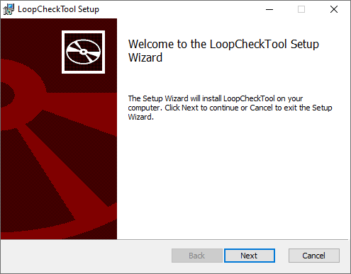

# Loop Check Tool
LoopCheckTool is a utility for automatically generating a templated document in Word from data from an Excel file.

It fills in Word document templates with values read from each row in the Excel file. When all rows have been processed, each generated template file is concatenated into one big output document. It is intended to be used for generating large LoopCheck documents from an IO List very quickly.

LoopCheckTool is licensed under the 3-Clause BSD License, meaning that **you are free to modify it and use it commercially**. It is available for free from [the LoopCheckTool GitHub repository](https://github.com/snhardin/LoopCheckTool).

### Prerequisites
* .NET Core 3.1
* Windows 10 (for MSI)
* Office 2019 is optional and not required to generate documents

## Quick Start

1. Download and install LoopCheckTool.

2. Download the [sample project](./LoopCheckTool.Documentation/src/static/projects/sample.zip) from the User Guide. Extract all contents to disk.

3. Launch the LoopCheckTool Wizard and follow the steps for using the sample in the User Guide.

4. Open the generated document.

5. Select all text, right-click to open the context menu, and select **Update Field**.

6. Customize to your own needs, add your own data, or create your own templates and spreadsheet.

